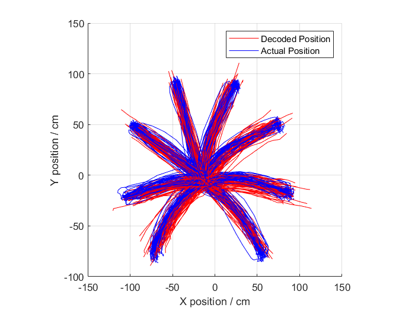

# BrainMachineInterfaceDecoder
During a brain machine interface module we were tasked with the design or a neural decoder to reconstruct the trajectory of a monkey's hand movement given invasive neural recordings. This project was completed in a team of 4.

It was then assessed via a group report contained in Report.pdf. Our best performing trajectory recontruction consisted of an LDA classification of reaching direction followed by a linear regressor for the corresponding reaching angle. The result achieved a RMSE of 16.2cm and runtime of 14.0s over the 50 training and 50 testing samples:

The methods have been presented, however, the data required for training and validation could not be shared due to a licensing agreement.
